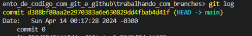
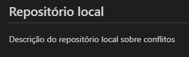
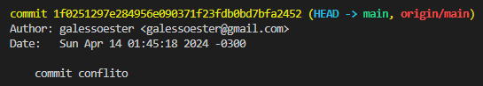
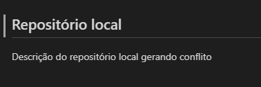
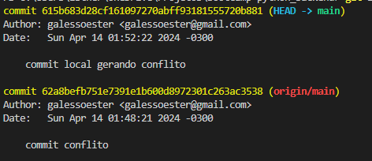
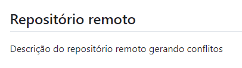
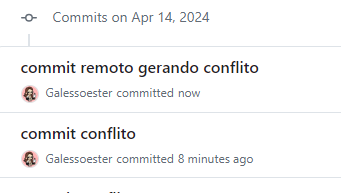
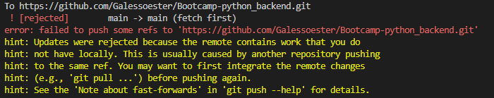
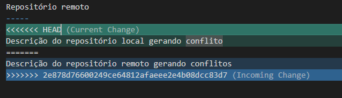
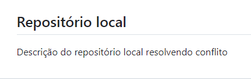

# 🌴 Mexendo com branches

Para demonstrar o funcionamento das branches, vamos criar alguns arquivos na branch main com o comando
```
echo "commit-1-branch-main" > commit-1-branch-main.txt
git add .
git commit -m "commit 1"
echo "commit-2-branch-main" > commit-2-branch-main.txt
git add .
git commit -m "commit 2"
```
---------------------------------
**Nesse momento podemos pereber que a main está apontando para o commit 2.**



> *Desculpe pessoal, acabei tirando o print errado e só percebi depois que terminei todo o processo*

-------------------------------

Vamos criar e entrar na branch chamada teste com o comando
```
git checkout -b 'teste'
```

**Agora as duas branches estão apontando para o mesmo commit:**


----------------
Vamos criar um novo arquivo com o nome commit-3-branch-teste e dar o commit, agora na branch teste, para ver o que acontece:


Vemos que a branch teste aponta para o commit 3, mas a branch main ficou no commit 2. 
Para nivelar as duas precisamos dar o comando "merge".
```
git checkout main
git merge teste
```
**Resultado:**


-------------------
Para finalizar, vamos excluir a branch teste:


# 😵 Tratando conflitos

Acotece muito, quando estamos trabalhando em equpe, de duas pessoas fazerem alterações simultaneas na mesma linha de código. Isso gera um conflito na hora de dar o merge. Vamos simular uma situação dessa e demonstrar a solução.

Vou fazer uma alteração no README.md no repositório local, e outra no repositório remoto e dar o commit nas duas. Acompanhe com os prints:


**1 - Primeiro adiocionei um titulo e uma descrição no repositório local e dei um commit para que os dois repositórios estivessem na mesma página:**

  

**2 - Depois gerei um conflito entre os repositórios alterando a mesma linha e dando commit separadamente:**

 
 

**3 - Tentei dar o `git push` do local para o remoto mas apareceu o seguinte erro:**



**4 - A solução está escrita no erro. Precisamos dar um `git pull` para podermos analizar as alterações e escolher a versão que deve permanecer:**



**5 - Após corrigirmos as divergências, será possivel fazer o `git push` normalmente:**



<sub> Resultado: </sub>

Repositório local 
-----
Descrição do repositório local resolvendo conflito

## 📚 Documentação: ~
- [Git](https://git-scm.com/docs/git/pt_BR)
- [GitHub](https://docs.github.com/pt)

