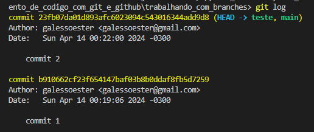
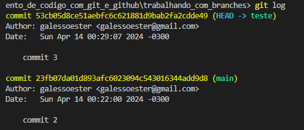
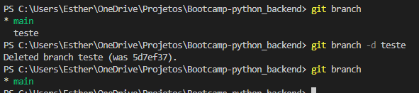

# 🌴 Mexendo com branches

Para demonstrar o funcionamento das branches, vamos criar alguns arquivos na branch main com o comando
```
echo "commit-1-branch-main" > commit-1-branch-main.txt
git add .
git commit -m "commit 0"
echo "commit-2-branch-main" > commit-2-branch-main.txt
git add .
git commit -m "commit 1"
```
---------------------------------
**Nesse momento podemos pereber que a main está apontando para o commit 2.**


> *Desculpe pessoal, acabei tirando o print errado e só percebi depois que terminei todo o processo*

-------------------------------

Vamos criar e entrar na branch chamada teste com o comando
```
git checkout -b 'teste'
```

**Agora as duas branches estão apontando para o mesmo commit:**


----------------
Vamos criar um novo arquivo com o nome commit-3-branch-teste e dar o commit, agora na branch teste, para ver o que acontece:


Vemos que a branch teste aponta para o commit 3, mas a branch main ficou no commit 2. 
Para nivelar as duas precisamos dar o comando "merge".
```
git checkout main
git merge teste
```
**Resultado:**


-------------------
Para finalizar, vamos excluir a branch teste:



# 😵 Tratando conflitos

Acotece muito, quando estamos trabalhando em equpe, de duas pessoas fazerem alterações simultaneas na mesma linha de código. Isso gera um conflito na hora de dar o merge. Vamos simular uma situação dessa e demonstrar a solução.

**Vou fazer uma alteração no README.md no repositório local, e outra no repositório remoto e dar o commit nas duas:**

Repositório remoto 
Descrição do repositório remoto gerando conflitos

