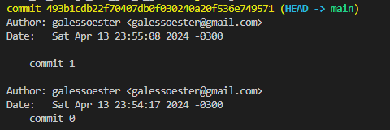
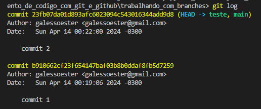

# 🌴 Mexendo com branches

Para demonstrar o funcionamento das branches, vamos criar alguns arquivos na branch main com o comando
```
echo "commit-1-branch-main" > commit-1-branch-main.txt
git add .
git commit -m "commit 0"
echo "commit-2-branch-main" > commit-2-branch-main.txt
git add .
git commit -m "commit 1"
---------------------------------
```
* Nesse momento podemos pereber que a main está apontando para o commit 2.

-------------------------------

Vamos criar e entrar na branch chamada teste com o comando
```
git checkout -b 'teste'
```
Agora as duas branches estão apontando para o mesmo commit:


----------------
Vamos criar um novo arquivo com o nome commit-3-branch-teste e dar o commit, agora na branch teste para ver o que acontece: